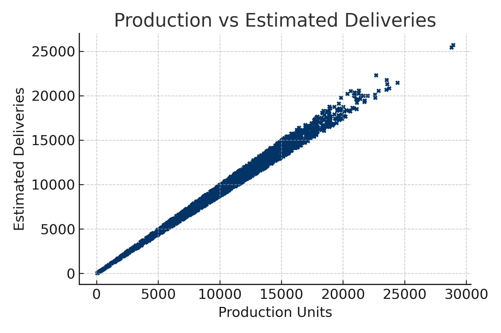

<p align="center">
  
</p>

# 🏎️ Tesla Üretim & Teslimat Analizi (2015–2025)

Bu proje, Tesla'nın 2015–2025 yılları arasındaki üretim ve teslimat verilerini kullanarak
**Production_Units → Estimated_Deliveries** ilişkisini inceleyen basit bir lineer regresyon çalışmasıdır.

Veri seti temizdir, eksik veri içermez ve sayısal olarak güçlü bir doğrusal ilişki barındırır.

## 📦 Proje Yapısı
 Tesla-Linear-Regression
 ├── analysis.ipynb                 → Açıklamalı Jupyter Notebook
 ├── analysis.py                    → Ham Python analiz dosyası
 ├── tesla_deliveries_dataset_2015_2025.csv   → Veri seti
 ├── plot.png                       → Scatter plot görseli
 └── README.md                      → Proje dökümantasyonu


---

## 📌 Proje İçeriği

Aşağıdaki işlem adımları uygulanmıştır:

- Veri setinin okunması  
- İlk inceleme (EDA)  
- Scatter plot ile ilişki kontrolü  
- Eğitim/Test ayrımı  
- Lineer regresyon modeli kurulumu  
- Modelden elde edilen metriklerin hesaplanması  
- Sonuçların yorumlanması  

---

##  Veri Seti Özeti

| Bilgi | Değer |
|-------|-------|
| Toplam Satır | **2640** |
| Toplam Sütun | **12** |
| Eksik Veri | **0** |
| Kullanılan Değişkenler | Production_Units (X), Estimated_Deliveries (Y) |

### Kullanılan temel kolonlar:

| Sütun | Açıklama |
|-------|----------|
| Production_Units | Tesla üretim adedi (X) |
| Estimated_Deliveries | Tahmini teslimatlar (Y) |

---

##  Scatter Plot (X → Y İlişkisi)

Tesla üretim ve teslimat arasındaki ilişki aşağıdaki grafikte gösterilmektedir:



### **Grafik Yorumu**
- Noktalar neredeyse düz bir çizgi üzerinde  
- Üretim arttıkça teslimat da artıyor  
- Bu, **çok güçlü bir doğrusal ilişki** olduğuna işaret ediyor  

---

## 🧪 Uygulanan Veri İşleme Adımları

### 📘 Veri Okuma

```python
df = pd.read_csv("tesla_deliveries_dataset_2015_2025.csv")
```

## 🧠 Veri İnceleme (EDA)

Veri yüklendikten sonra temel inceleme adımları uygulanmıştır:


```python
df.head()
df.info()
df.describe()
```
Bu işlemler ile:
- Veri türleri görüldü
- Eksik veri olmadığı doğrulandı
- Sayısal kolonların dağılımı incelendi
- Modelde kullanacağımız kolonların uygunluğu kontrol edildi

## 🖊️ Eğitim / Test Ayrımı

Modeli daha gerçekçi değerlendirmek için veri eğitim/test olarak ayrıldı:
```
from sklearn.model_selection import train_test_split

X = df[["Production_Units"]]
y = df["Estimated_Deliveries"]

X_train, X_test, y_train, y_test = train_test_split(X, y, test_size=0.2, random_state=42)
```
## Lineer Regresyon Modeli

### Lineer regresyon modeli kurulumu:
```
from sklearn.linear_model import LinearRegression

model = LinearRegression()
model.fit(X_train, y_train)
```

### Model eğitim parametreleri:
```
slope = model.coef_[0]
intercept = model.intercept_
```
## Model Sonuçları

### Aşağıdaki değerlendirme sonuçları elde edilmiştir:

Metrik	Değer
Eğim (β₁)	0.9173
Sabit (β₀)	144.56
R² Skoru	0.9884
RMSE	415.1

## ❌ Hata Hesaplamaları

### Modelin performansı test verisi üzerinde ölçülmüştür:
```
from sklearn.metrics import mean_squared_error, r2_score
import numpy as np

y_pred = model.predict(X_test)

r2 = r2_score(y_test, y_pred)
rmse = np.sqrt(mean_squared_error(y_test, y_pred))
```
## 💬 Sonuçların Yorumlanması

- R² değerinin 0.98 olması, modelin veriyi neredeyse tamamen açıkladığını gösteriyor.

- RMSE düşük, yani tahminler gerçek değerlere yakın.

- Üretim arttıkça teslimat miktarının doğrusal şekilde arttığı açıkça görülüyor.

- Veri temiz olduğu için model hiçbir ek işlem gerektirmedi.

## Kullanılan Grafik

Aşağıdaki grafik veri ilişkisini göstermektedir:


## Genel Değerlendirme

- Bu çalışma sonucunda:

- Basit lineer regresyon modeli bu veri için oldukça başarılıdır.

- Tesla üretim → teslimat ilişkisi net doğrusal bir yapıya sahiptir.

- Veri seti temiz, dengeli ve analiz için idealdir.

- Üretim miktarı, teslimat miktarını yüksek doğrulukta tahmin edebilmektedir.

