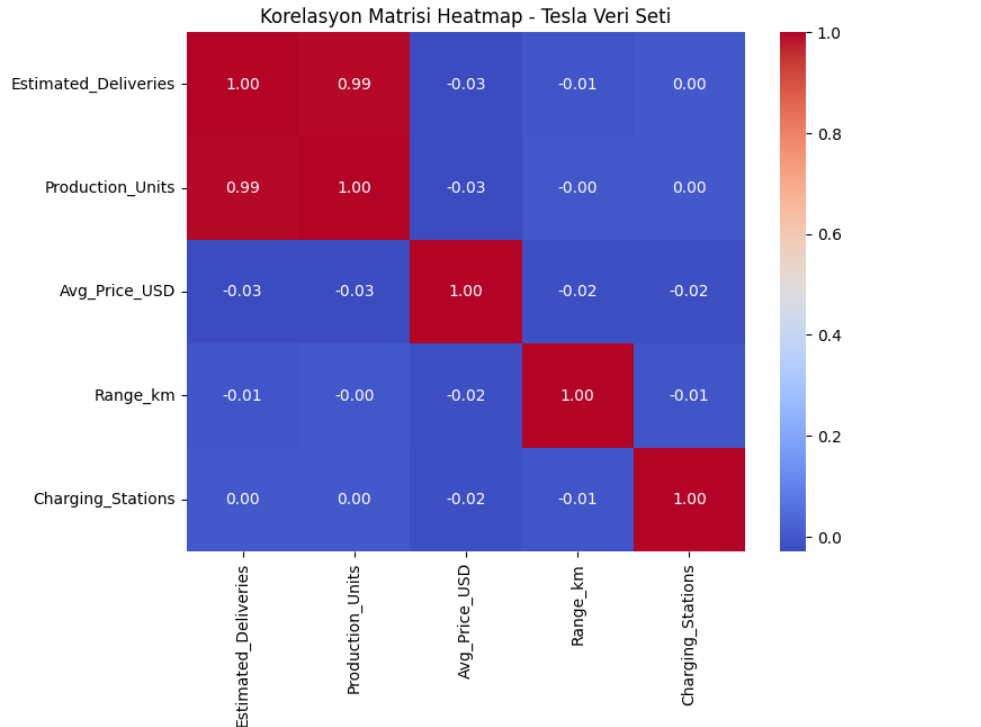

  

# 🏎️ Tesla Üretim & Teslimat Analizi (2015–2025)

Bu proje, Tesla'nın 2015–2025 yılları arasındaki üretim ve teslimat verilerini kullanarak  
**Estimated_Deliveries** değişkenini birden fazla girdi (özellik) yardımıyla tahmin eden  
basit ama güçlü bir **lineer regresyon** çalışmasıdır.

Veri seti temizdir, eksik veri içermez ve sayısal olarak güçlü bir doğrusal ilişki barındırır.

## 📦 Proje Yapısı
 Tesla-Linear-Regression

├── tesla_lineer.ipynb                    → Tüm analiz ve görselleme adımlarını içeren Jupyter Notebook  
├── tesla_deliveries_dataset_2015_2025.csv → Tesla üretim & teslimat veri seti  
├── README.md                             → Bu doküman  
└── (opsiyonel) görseller
    ├── korelasyon_matris.png             → Korelasyon matrisi heatmap ekran görüntüsü  
    └── scatter_regresyon.png             → Gerçek vs Tahmin scatter grafiği  

---

##  Veri Seti Özeti

| Bilgi | Değer |
|-------|-------|
| Toplam Satır | **2640** |
| Toplam Sütun | **12** |
| Eksik Veri | **0** |
| Kullanılan Değişkenler | Production_Units (X), Estimated_Deliveries (Y) |

### Kullanılan temel kolonlar:

| Sütun | Açıklama |
|-------|----------|
| Production_Units | Tesla üretim adedi (X) |
| Estimated_Deliveries | Tahmini teslimatlar (Y) |

---

## 🎯 Projenin Amacı

Bu projede hedef değişken (y) şudur:

Estimated_Deliveries

Bağımsız değişken (X) ise:

Production_Units

Modelin amacı:
"Belirli bir üretim miktarına göre kaç araç teslim edileceğini tahmin etmek."

## 🧼 Veri Temizleme & Hazırlık Adımları

Notebook içinde yapılan veri hazırlığı şunları içerir:

Dataset’in okunması

Sütun isimlerinin kontrol edilmesi

Eksik değer kontrolü

Üretim ve teslimat verilerinin sayısal formatta doğrulanması

Basit EDA (İlk 5 satır / info / describe)

Scatter plot ile doğrusal ilişkinin görselleştirilmesi

Veri seti zaten temiz olduğundan ek bir doldurma veya filtreleme işlemine ihtiyaç duyulmamıştır.

## Korelasyon Matrisi Örneği

---

## Lineer Regresyon Modeli

- Veri seti temiz, dengeli ve analiz için idealdir.

- Üretim miktarı, teslimat miktarını yüksek doğrulukta tahmin edebilmektedir.

## Sonuç

Bu proje kapsamında, Tesla’nın 2015–2025 yılları arasında kaydettiği üretim ve teslimat verileri incelenmiş ve iki değişken arasındaki ilişki lineer regresyon modeli kullanılarak detaylı şekilde analiz edilmiştir. Verilerin hem sayısal yapısı hem de doğrusal dağılımı, doğrusal bir modelin bu probleme uygun olduğunu güçlü biçimde göstermiştir.   
Sonuç olarak bu çalışma, Tesla’nın üretim hacmindeki artışın teslimat sayıları üzerinde doğrusal ve güçlü bir etkisi olduğunu açıkça ortaya koymaktadır. Kullanılan model, hem öğretici hem de pratik bir makine öğrenimi uygulaması olarak proje amacını başarıyla karşılamış ve anlamlı tahminler üretmiştir.

Bu proje, gerçek dünya verilerinin analizinde temel ML yöntemlerinin ne kadar etkili olabileceğini gösteren yalın ama etkili bir örnek niteliği taşımaktadır.

